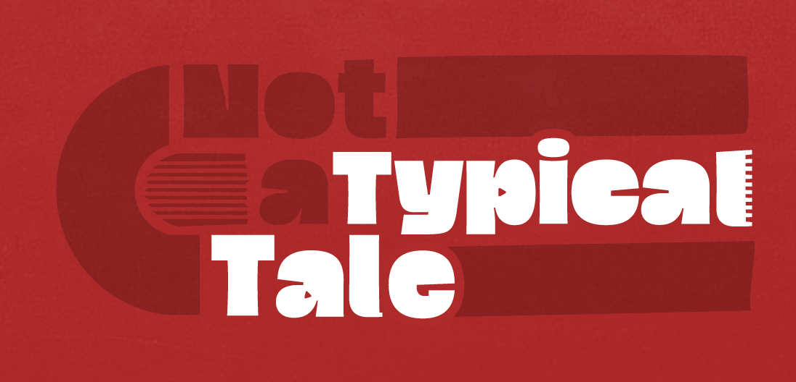
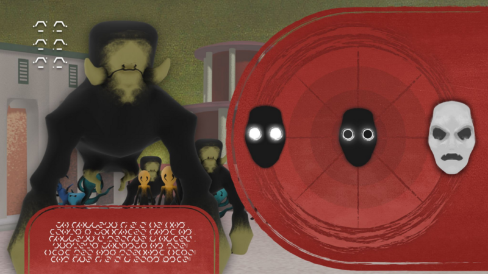
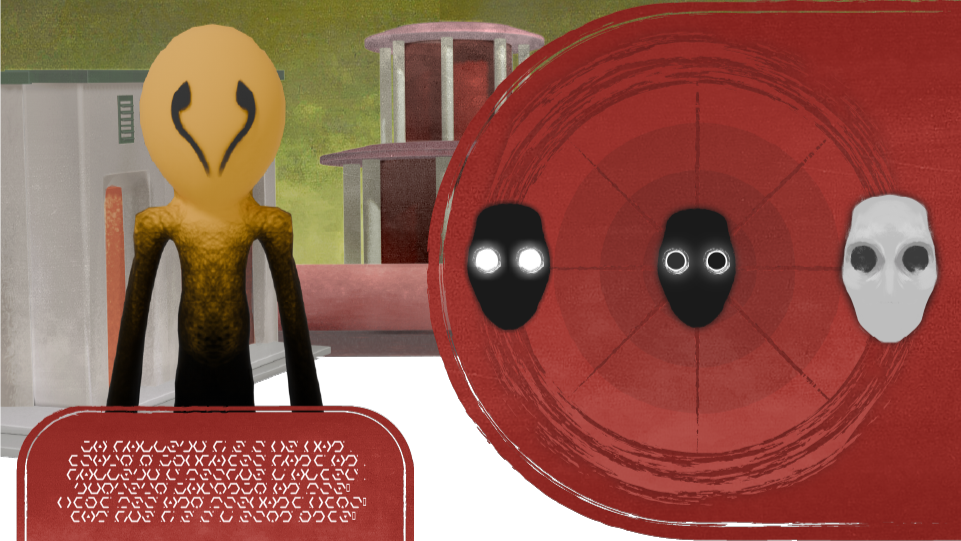
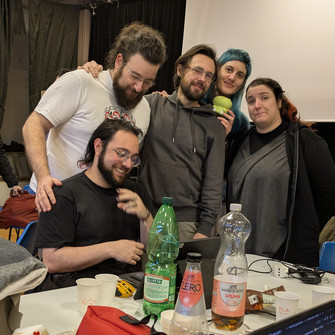

# Not a typical Tale

Global Game Jam 2026 entry

_"C'mon, let's make a game this time!"_

## About

Not a Typical Tale is a game where you try o assume different facial expressions to please (or not) the strange creatures who approach you.

Not a Typical Tale is about social masking and the emotional and energetic toll it takes.

## Images

    
    
    

## Jam Stats

|                        |                    |
| ---------------------- | ------------------ |
| Year                   | 2026               |
| Location               | Pisa, Italy        |
| Diversifiers           | _None_             |
| Tools and Technologies | Unity              |
| Tags                   | 2D/3D Emotions |

## Team -

From left to right

| Person            | Nickname     | Role                                     | Links                                                                                            |
| ----------------- | ------------ | ---------------------------------------- | ------------------------------------------------------------------------------------------------ |
| Nicolò Renzoni    | KlausRenzo   | Programmer   Fake blender prototyper | [GitHub](https://github.com/klausrenzo) [Instagram](https://www.instagram.com/klausrenzo)    |
| Francesco Nannini | Beleth_Thy   | Game Design   Computer-less jammer   | [Instagram](https://www.instagram.com/nanno._.98)                                                |
| Michele Lanzo     | Kr1st0       | Game Design   GDD Crafter            | [GitHub](https://github.com/m-lanzo)                                                             |
| Ila Scalia        | lilikoi      | Concept Artist   Mask connoisseur    | [Instagram](https://www.instagram.com/ilasc_/)                                          |
| Ilaria Baldassari | Sheira Fenix | Concept Artist   Rigging enjoyer     | [GitHub](https://github.com/sheirafenix) [Instagram](https://www.instagram.com/sheira_fenix) |
